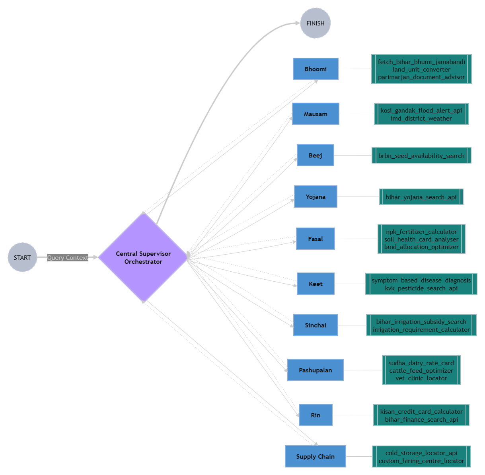

<div align="center">

<a href="https://git.io/typing-svg">
  
</a>

<p align="center">
  <a href="https://python.org">
    
  </a>
  <a href="https://langchain.com">
    
  </a>
  <a href="https://groq.com">
    
  </a>
  <a href="https://streamlit.io">
    
  </a>
</p>

<h3>An advanced AI-driven hub-and-spoke multi-agent system delivering fault-tolerant agricultural intelligence.</h3>

</div>

---

## 🌟 Introduction

**Krishi-Mitra** is a sophisticated, AI-driven agricultural intelligence system engineered to deliver real-time, highly localized farming advisories. Moving beyond the limitations of standard tool-calling wrappers, this project implements a resilient **hub-and-spoke multi-agent architecture**. By orchestrating specialized domain workers through a centralized LangGraph state machine, Krishi-Mitra overcomes the inherent fragility of static web scraping. 

This architectural depth ensures fault-tolerant, deterministic execution across complex domains—from supply chain logistics and cold storage tracking to precise Kisan Credit Card (KCC) calculations. Designed to bridge the digital divide, the system is actively laying the groundwork for multimodal diagnostics and accessible acoustic interfaces natively supporting regional dialects like Hindi and Bhojpuri, delivering enterprise-grade precision directly to the grassroots level.

---

## ✨ Key Features

* **Multi-Agent Orchestration:** A central `Supervisor` node intelligently routes user queries to 10+ specialized domain workers (e.g., `SupplyChain`, `Mausam`, `Beej`).
* **Deterministic State Transitions:** Abandons fragile native tool-calling in favor of strictly enforced `json_mode` parsing via Pydantic, ensuring 100% routing stability.
* **Programmatic Safeguards:** Features a built-in deterministic loop-breaker (`ask_user_for_missing_data`) that intercepts incomplete queries and prompts the user for required parameters, completely mitigating API execution crashes.
* **Dynamic Information Retrieval:** Integrates Tavily and DuckDuckGo search pipelines to fetch live, localized agricultural data instead of relying on unstable static government portal scraping.
* **Sub-Second Routing Latency:** Utilizes the Groq API (`openai/gpt-oss-120b`) to execute complex state-graph routing decisions almost instantaneously.

---

## 🤖 Specialized Domain Agents & Tools

Krishi-Mitra employs a decentralized fleet of expert worker nodes, each strictly scoped to a specific agricultural domain. A central `Supervisor` evaluates state parameters and dynamically routes user queries to the appropriate agent for tool execution. 

*(Click on an agent to expand and view its respective tools)*

<details>
<summary><b>🌾 Fasal (Agronomy & Crop Cycles)</b></summary>
<br>

* **Focus:** Delivers precise fertilizer recommendations and optimal crop rotation schedules based on real-time localized conditions.
* **Key Tools:** 
  * `npk_fertilizer_calculator()`: Calculates Nitrogen-Phosphorus-Potassium (NPK) baselines.
  * `soil_health_card_analyzer()`: Parses soil metrics to generate actionable remediation steps.
  * `land_allocation_optimizer()`: Optimizes crop allocation based on available land area.
</details>

<details>
<summary><b>🌱 Beej (Seeds & Subsidies)</b></summary>
<br>

* **Focus:** Retrieves live data on high-yield variety (HYV) seeds and calculates state-sponsored agricultural subsidies.
* **Key Tools:** 
  * `brbn_seed_availability_search()`: Scrapes dynamic availability of specific seed strains.
</details>

<details>
<summary><b>🗺️ Bhoomi (Land & Soil Management)</b></summary>
<br>

* **Focus:** Interfaces with digital land registries and interpret land records.
* **Key Tools:** 
  * `fetch_bihar_bhumi_jamabandi()`: Queries Bihar Bhulekh/land registry endpoints for Jamabandi details.
  * `land_unit_converter()`: Converts between various local land measurement units.
  * `parimarjan_document_advisor()`: Advises on required documents for land record corrections (Parimarjan).
  * `bataidari_settlement_calculator()`: Calculates settlements for sharecropping (Bataidari).
</details>

<details>
<summary><b>🐛 Keet (Pest & Disease Diagnostics)</b></summary>
<br>

* **Focus:** Cross-references observed crop anomalies with databases to provide accurate chemical and organic interventions.
* **Key Tools:** 
  * `symptom_based_disease_diagnosis()`: Maps visual and textual symptoms to specific pathogens.
  * `kvk_pesticide_search_api()`: Searches KVK database for recommended pesticide treatments.
</details>

<details>
<summary><b>⚖️ Mandi (Market Intelligence)</b></summary>
<br>

* **Focus:** Fetches real-time prices from APMC markets.
* **Key Tools:** 
  * `agmarknet_price_scraper()`: Retrieves daily crop pricing via Agmarknet dynamic search.
</details>

<details>
<summary><b>⛈️ Mausam (Weather & Climate Alerts)</b></summary>
<br>

* **Focus:** Provides meteorological forecasts, extreme weather warnings, and localized flood risk assessments.
* **Key Tools:** 
  * `imd_district_weather()`: Pulls current weather predictions for specific districts via IMD.
  * `kosi_gandak_flood_alert_api()`: Monitors river basin levels and alerts for Kosi and Gandak rivers.
</details>

<details>
<summary><b>🐄 Pashupalan (Dairy & Veterinary)</b></summary>
<br>

* **Focus:** Supports livestock management, tracks veterinary availability, and targets dairy initiatives.
* **Key Tools:** 
  * `sudha_dairy_rate_card()`: Calculates milk rates based on fat and SNF percentages.
  * `cattle_feed_optimizer()`: Optimizes cattle feed based on yield and body weight.
  * `vet_clinic_locator()`: Locates active veterinary officers or clinics in the district.
</details>

<details>
<summary><b>💰 Rin (Financial & Credit Services)</b></summary>
<br>

* **Focus:** Computes Kisan Credit Card (KCC) borrowing limits and queries financial services.
* **Key Tools:** 
  * `kisan_credit_card_calculator()`: Generates exact credit boundaries based on cropping patterns.
  * `bihar_finance_search_api()`: Queries topics related to Bihar agricultural finance.
</details>

<details>
<summary><b>💧 Sinchai (Irrigation Logistics)</b></summary>
<br>

* **Focus:** Optimizes water usage and assesses irrigation subsidies.
* **Key Tools:** 
  * `bihar_irrigation_subsidy_search()`: Searches for available irrigation subsidies in Bihar.
  * `irrigation_requirement_calculator()`: Calculates precise water requirements for crops.
</details>

<details>
<summary><b>🚚 Supply_Chain (Storage & Logistics)</b></summary>
<br>

* **Focus:** Identifies available cold storage facilities and custom hiring centers.
* **Key Tools:** 
  * `cold_storage_locator_api()`: Locates nearby refrigerated warehouses with available capacity.
  * `custom_hiring_center_locator()`: Finds available machinery at local Custom Hiring Centers.
</details>

<details>
<summary><b>📜 Yojana (Government Schemes)</b></summary>
<br>

* **Focus:** Matches farmers with relevant central/state agricultural schemes.
* **Key Tools:** 
  * `bihar_yojana_search_api()`: Compiles localized information on active government programs.
</details>

<details>
<summary><b>🛡️ Missing_Data (Programmatic Safeguard)</b></summary>
<br>

* **Focus:** The deterministic loop-breaker logic.
* **Key Tools:** 
  * `ask_user_for_missing_data()`: If the `Supervisor` detects incomplete parameters for tool execution, it routes here to explicitly prompt the user, preventing system hallucinations and pipeline crashes.
</details>

---

## 📂 Project Directory Structure

```text
Krishi_mitra/
├── src/
│   ├── tools/                    # Specialized agent toolsets
│   │   ├── Beej_tools.py         # Seeds & Subsidies data retrieval
│   │   ├── Bhoomi_tools.py       # Land & Registry data
│   │   ├── Fasal_tools.py        # Agronomy & NPK recommendations
│   │   ├── Keet_tools.py         # Pest & Disease diagnostics
│   │   ├── Mandi_tools.py        # Live market prices
│   │   ├── Mausam_tools.py       # Weather & Flood tracking
│   │   ├── Missing_Data_tools.py # Programmatic fallback safeguard
│   │   ├── Pashupalan_tools.py   # Dairy & Veterinary services
│   │   ├── Rin_tools.py          # KCC & Financial limits
│   │   ├── Sinchai_tools.py      # Irrigation logistics
│   │   ├── Supply_Chain_tools.py # Cold Storage & Logistics tracking
│   │   └── Yojana_tools.py       # Government Schemes & DBT
│   ├── app.py                    # Streamlit conversational web interface
│   ├── graph.py                  # LangGraph state-graph & routing logic
│   └── state.py                  # Pydantic state schemas & validation
├── tests/                        # Unit and integration test suites
├── .env                          # API keys (Groq, Tavily, LangSmith)
├── .gitignore                    # Git ignore file
├── .python-version               # Python version specification
├── langgraph.json                # LangGraph Studio configuration
├── main.py                       # CLI entry point / Main execution script
├── requirements.txt              # Project dependencies
└── pyproject.toml                # Project dependencies and metadata

---

## 🏗️ Architecture Diagram

<div align="center">
  
</div>

---

## 🤝 Contribution

We welcome contributions to make **Krishi-Mitra** even better! 

1. **Fork** the repository.
2. **Create** a new branch (`git checkout -b feature/AmazingFeature`).
3. **Commit** your changes (`git commit -m 'Add some AmazingFeature'`).
4. **Push** to the branch (`git push origin feature/AmazingFeature`).
5. **Open a Pull Request**.

---

<div align="center">
  
  <br>
  <br>
  <a href="https://git.io/typing-svg">
    
  </a>
</div>